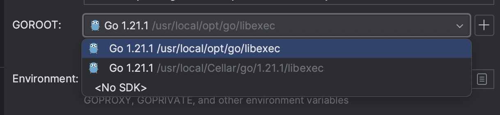
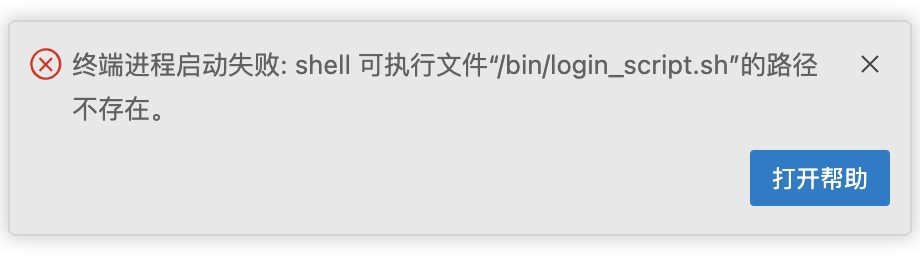

# 安装
https://go.dev/dl/



GOROOT 就是JDK的变量地址。
https://blog.csdn.net/qq_38151401/article/details/105729884

环境变量的shell要改一下：


但是明明
```
$ go version
go version go1.21.3 darwin/amd64
```

```
$ which go
/usr/local/go/bin/go
```
哪里出了问题？

# 文档比较篇
https://pkg.go.dev/




```json
 "terminal.integrated.defaultProfile.osx":"zsh",
 ```
 或者直接在setting中进行配置。